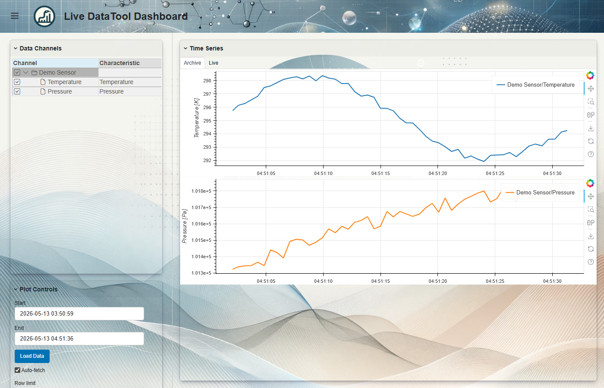
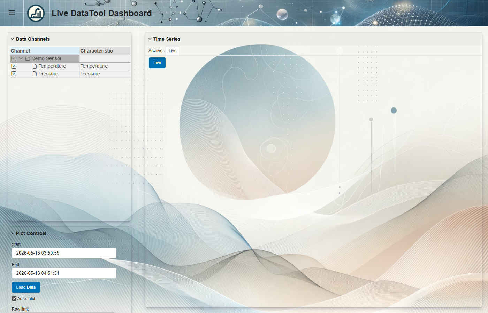

[](https://pypi.org/project/opensemantic.lab/)
[](https://coveralls.io/r/OpenSemanticWorld-Packages/opensemantic.lab)

# opensemantic.lab

Python models and controllers for the `world.opensemantic.lab` page package.

Builds on [opensemantic.base](https://github.com/OpenSemanticWorld-Packages/opensemantic.base-python) (`DataToolController`, `TimeSeriesDatabaseController`, archiving, typed read/write).

## Overview

- **Auto-generated Pydantic models** (v1 and v2): OpcUaServer, OpcUaDataChannel, LaboratoryProcess, Sample, Material, etc.
- **OpcUaServer controller** - OPC UA client/server lifecycle with channel subscriptions and data archiving

## OpcUaServer controller

Extends `DataToolController` with OPC UA protocol logic:

```python
from opensemantic import compute_scoped_uuid
from opensemantic.lab.v1 import OpcUaServer, OpcUaDataChannel, OpcUaClientMode
from opensemantic.characteristics.quantitative.v1 import Temperature, Time, TimeUnit
from opensemantic.core.v1 import Label
from uuid import NAMESPACE_URL, uuid5

SERVER_UUID = uuid5(NAMESPACE_URL, "my-server")

server = OpcUaServer(
    uuid=SERVER_UUID,
    name="my_server",
    label=[Label(text="My Server")],
    url="opc.tcp://localhost:4840",
    data_channels=[
        OpcUaDataChannel(
            uuid=compute_scoped_uuid(SERVER_UUID, "ns=2;s=Temperature"),
            node_id="ns=2;s=Temperature",
            name="temperature",
            label=[Label(text="Temperature")],
            opcua_data_type="Float",
            client_mode=OpcUaClientMode.Subscription,
            sampling_interval=Time(value=100, unit=TimeUnit.milli_second),
            refresh_interval=Time(value=500, unit=TimeUnit.milli_second),
            characteristic=Temperature.get_cls_iri(),
        ),
    ],
    auto_archive=True,
)
```

### OPC UA-specific methods

- `run_as_server(params)` - start an OPC UA server with value callbacks
- `run_as_client(params)` - connect, subscribe to channels, auto-archive
- `read_channel(params)` / `write_channel(params)` - direct channel I/O
- `browse(params)` - browse the OPC UA address space
- `stop()` - flush archive buffer and disconnect

### Channel UUIDs

OpcUaDataChannel requires an explicit UUID. Use `compute_scoped_uuid(server_uuid, node_id)` from `opensemantic` to avoid collisions across servers.

### Controller fields (runtime only)

`url`, `archive_database`, `auto_archive`, `reset_opcua_connection_on_error` are controller-only fields. They are stripped from `to_json()` / `to_jsonld()` serialization. Set them as runtime config when constructing the controller.

### Inherited features

All DataTool features from `opensemantic.base` work automatically: auto-archive from `storage_locations`, typed read/write, subobject ID prefixing, channel characteristic warnings. See the [opensemantic.base README](https://github.com/OpenSemanticWorld-Packages/opensemantic.base-python) for details.

## LiveDataToolView (Live Dashboard UI)

Extends the base `DataToolView` with real-time OPC UA streaming via Bokeh.

Features:
- Archive tab with all base DataToolView features (stacked plots, unit switching, log console)
- Live tab with Bokeh streaming plots updated via OPC UA subscriptions
- Per-channel unit conversion for live data
- Configurable history window, buffer size, and update interval via JsonEditor


*Interactive demo: archive view and real-time OPC UA streaming*



*Archive view with accumulated OPC UA data*



*Real-time OPC UA streaming with stacked Bokeh plots*

```python
from opensemantic.lab.view import LiveDataToolView
from opensemantic.base.view._config import LiveDashboardConfig, PlotConfig

view = LiveDataToolView(
    controllers=[ctrl],
    config=LiveDashboardConfig(lang="en", plot=PlotConfig(auto_fetch=True)),
    title="Live Dashboard",
)
view.servable()
```

See [examples/live_dashboard.py](examples/live_dashboard.py) for a full working example with an embedded OPC UA server.

To regenerate the screenshots after UI changes, see [docs/generate_screenshots.py](docs/generate_screenshots.py).

## Examples

See `examples/` for complete runnable examples:

- `opc_ua_server.py` - define server, store to oold backend, run
- `opc_ua_client.py` - load from backend, connect, print archived data
- `opcua_archiving.py` - full workflow with auto-archiving and typed read/write
- `live_dashboard.py` - live dashboard with embedded OPC UA server

## Installation

```bash
pip install opensemantic.lab             # models only
pip install opensemantic.lab[controller] # + asyncua, opensemantic.base[controller]
pip install opensemantic.lab[view]       # + opensemantic.base[view]
```

## Testing

```bash
pytest tests/test_controller.py
```

Tests include OPC UA server/client integration (uses asyncua's built-in test server, no external services needed).

For PostgREST-based archiving tests, see the [opensemantic.base testing docs](https://github.com/OpenSemanticWorld-Packages/opensemantic.base-python#testing) - requires a running [pgstack](https://github.com/opensemanticworld/pgstack) instance with TimescaleDB.
